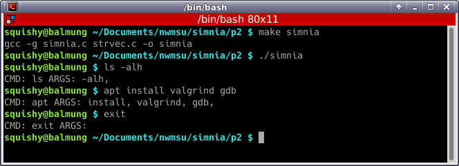

# Project 2: The Simnia RePL

## Building your Shell, part 2

## 44-550 Operating Systems

## 50 points

In this project we will set up our Read, Eval, Print Loop (REPL).
We are not going to add the part of the shell that handles launching processes at this time (we will be stubbing it in), so it's more
of a Read, Eval(ish), Print Loop, or RePL.
You will be responsible not only for the C source code for this project, but also the Makefile.
Your string vector code from the previous project will be very helpful here.
You will be creating an additional `.h/.c` file pair to contain the utility functions for this shell

---

### Milestones

| Milestone | Tests Passed |
| --- | --- |
| Modify `Makefile` and main `.c` source file | Tests on GitHub will run |
| Implement basic shell functionality| Tests will pass |
| Improve `prompt` | |

---

### Milestone and Function Descriptions

#### Milestone 1

Copy your string vector into this directory.
Create  your main source file (you can write a simple main function that does nothing, or hello world, or really anything!).
Modify the `Makefile` with a target named `simnia` that compiles all of the requisite source files into a single executable named `simnia`
(we will call it `simnia` because a simnia is a rather simple seashell, and we're writing a rather simple C Shell... I'm so sorry).

When you've completed this milestone, you MUST be able to run the following to run your shell:

```bash
make simnia
./simnia
```

### Milestone 2: basic functionality

You are required to write three basic functions (in a `.h/.c` file pair that can be named whatever you like).
The function names and descriptions below are the ones I chose; you may architect your solution in a way that makes sense to you.
However, you are required to have at least one function that prompts the user, one function that reads the user's input,
and one function that executes the command.
Make sure to add these files to the build prerequisites in the Makefile.

#### `void prompt()`

Prints an indicator to the screen; at this point a simple `printf("$> ")` can suffice; we will be modifying this later

#### `void read_cmd(strvec * cmd)`

Reads a single line from stdin, tokenizes it (splits it on spaces and newlines), and stores the resulting string in the strvec parameter.
You probably want to empty (`strvec_free`) `cmd` before loading it with the new commands.
In my solution, since the argument is a pointer, the result is "sent back" to `main`, where it will be passed to the next function.

Tokenizing may be the most bizarre part of this function; for this we will use the `strtok` function (https://en.cppreference.com/w/c/string/byte/strtok).
We will be doing this because of the way the execution functions will work in the next part of this project.

Since this is a very I/O heavy operation, and we haven't discussed it much in detail, here is a possible implementation:

```c
void read_cmd(strvec * cmd)
{
	char * buffer = calloc(256, sizeof(char*));
	size_t buffsize = 256;
	int read = getline(&buffer, &buffsize, stdin);
	// make sure the string vector of commands is empty
	strvec_free(cmd);
	strvec_init(cmd);
	char * ptr = strtok(buffer, " \n");
	while (ptr)
	{
		strvec_push(cmd, ptr);
		ptr = strtok(NULL, " \n");
	}
	free(buffer);
	return;
}
```

#### `void exec_cmd(const strvec * cmd)`

"Executes" the command.  For now, you are to print the command (the strvec at index 0) and the arguments to the command (see the sample I/O below for the format)

#### Finalizing the Functionality

After you have written your functions, your main function should simply create a strvec (and init it), then loop your three functions until the user runs "exit".
Your loop can be as simple as:
```c
	do {
		prompt();
		read_cmd(&cmd);
		exec_cmd(&cmd);
	} while (strcmp(strvec_get(cmd, 0), "exit") != 0);
```
Your loop may differ depending on what you named your functions and your strvec (mine is `cmd`, and it was initialized above the do while loop).
At this point you should be able to pass the tests that will run when you push your code.

### Milestone 3

The basic prompt is quite basic and boring; you get to have a chance to personalize it a little bit.
I will not tell you a specific improvement you have to make. Some possibilities:

* Use colors to make it stand out
* Print the username and/or the hostname and/or the current working directory
* ...?  Get creative!  There's not a wrong answer here, but I want you to personalize your shell a little bit.

Some helpful resources:

* Adding color to your output: <http://web.theurbanpenguin.com/4184-2/>
* Getting the user login: <https://pubs.opengroup.org/onlinepubs/7908799/xsh/getlogin.html>
* Getting the hostname: <http://man7.org/linux/man-pages/man2/gethostname.2.html>

Note that a lot of the user/host/stuff is part of the `unistd.h` library.
Also, it is possible that on WSL you will get NULL as the username, depending on how you do it.  It's weird like that.

### Sample IO

You will notice that I made my prompt `user@hostname` and used the same colors as my default prompt; the biggest difference is that I did not print the current working directory in the prompt.



### Grading

Note: you must have created three files: your main source file (containing the `main` function), and a `.h/.c` pair with the shell functions.
These will be *in addition to* the `.h/.c` files containing your strvec.
You must have at least five files in your solution.

The comment headers must contain your name and a description of what the file is accomplishing.

| Criteria | Points Per Unit | Total Points |
| --- | --- | --- |
| At least one unique commit for each milestone | 1 / milestone | 3 |
| Commit messages describe what the commit is doing | 1 / milestone | 3 |
| Passes tests | 7/test | 21 |
| Tests run without memory leaks | 4/test | 12 |
| New files have appropriate comment header | 3/file | 9 |
| New files are formatted well and follow consistent coding standards (naming, spacing, etc) | 2 |
| ***Total*** | | ***50***|
